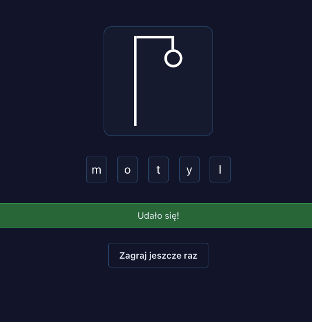

# Simple Hangman Game



A simple Hangman game built as a practice project using React, Vite, and TypeScript. Game includes 100 hardcoded Polish phrases for word guessing fun! Includes hints!

## Features

- Guess Polish phrases in a classic Hangman game.
- 100 predefined phrases to keep the game interesting.
- Use a hint if word becomes a challenge. 

## Installation

1. Clone the repository to your local machine:

   ```bash
   git clone https://github.com/your-username/hangman-game.git

2. Install dependencies and run locally:

   ```bash
   yarn && yarn dev
